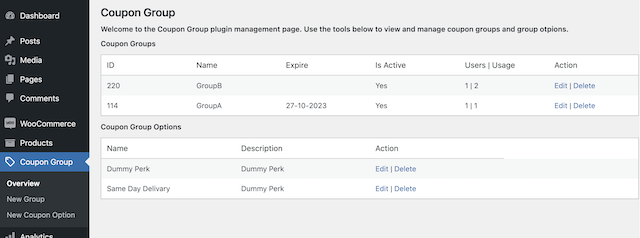
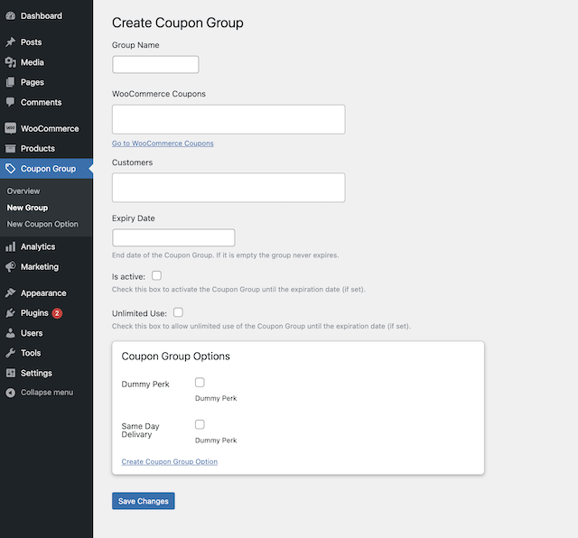

# Coupon Group WordPress Plugin

## Description

The "Coupon Group" plugin enhances your WooCommerce store by allowing you to create and manage coupon groups with unique offers. Customers can be added to these groups to access exclusive discounts and perks.

- Create multiple coupon groups with distinct offers.
- Add customers (registered users) to specific groups for personalized benefits.
- Admin interface for managing coupon groups and group memberships.
- Integrate seamlessly with WooCommerce for a streamlined user experience.

## Installation

1. Download the plugin ZIP file from the [GitHub repository](https://github.com/spyreto/coupon-group) ~~or from the [WordPress Plugin Repository](https://wordpress.org/plugins/coupon-group/)~~.
2. Upload the ZIP file to your WordPress site by navigating to **Plugins > Add New** and clicking the "Upload Plugin" button.
3. Activate the "Coupon Group" plugin from the WordPress plugins menu.

## Usage

### Creating Coupon Groups

1. In the WordPress admin dashboard, navigate to **Coupon Group** in the left-hand menu.
2. Click on **New Group** to create a new coupon group.
3. Specify the group name, add **WooCommerce coupons**, customers and expiry date.
4. Check the **Is Active** option to activate the offer until the expiry date (if set).
5. If you wish to allow unlimited use of this coupon group by users, check the **Unlimited Use** option.
6. Select any custom group options - perks (like "Same Day Delivary") to add to the group.
7. Save the group.

### Creating Group Options

1. In the WordPress admin dashboard, navigate to **Coupon Group** in the left-hand menu.
2. Click on **New Option** to create a new coupon group option.
3. Specify the option name and description (Those values will be visible to the user at the cart and checkout pages).
4. Save the option.

### Managing Groups and Options

1. To manage coupon groups and options, click to **Coupon Group** in the admin menu.
2. You will navigate to **Overview page**. where the coupon groups and options are displayed.
3. You can edit or delete an existing group or option, by clicking on the corresponding option (Edit or Delete).

(<a href="#top">back to top</a>)

## Screenshots

_The main plugin page, the overview page._

_Create new coupon group option page._

_Create new coupon group page._

(<a href="#top">back to top</a>)

## Frequently Asked Questions

### How Do Users Receive WooCommerce Coupons Through the "Coupon Group" Plugin?

With the "Coupon Group" plugin, users receive WooCommerce coupons automatically when they are added to specific coupon groups.

### Do Coupon Groups Automatically Deactivate When They Expire?

Yes, the "Coupon Group" plugin includes an expiration feature that allows you to set a specific expiration date for coupon groups. When a coupon group's expiration date is reached, the group is automatically deactivated.

### Is there a limit to the number of coupon groups I can create?

No, you can create as many coupon groups as needed to suit your business requirements.

### How Does the Activation and Deactivation of a Group Work?

Activation of a group within the "Coupon Group" plugin, instantly applying all associated WooCommerce coupons to group members, granting them discounts and perks during checkout. Conversely, deactivation, promptly removes these benefits from group members, reverting their orders to regular prices. These processes provide administrators with the flexibility to personalize user experiences based on group memberships, enhancing satisfaction and engagement.

### Can I Translate the Plugin into My Preferred Language?

Yes, you can translate the plugin into your preferred language. To do so, you can use WordPress translation plugins or manually edit the provided translation files. Translating the plugin allows you to customize it to your language and make it more accessible to users who speak different languages.

### Is the "Coupon Group" plugin free to use?

Yes, the "Coupon Group" plugin is free and open source. You can download and use it on your WordPress site without any cost.

### How can I provide feedback or report issues?

Please visit our [GitHub repository](https://github.com/spyreto/coupon-group/issues) to report issues or provide feedback.

(<a href="#top">back to top</a>)

## Changelog

### Version 1.0.0

(<a href="#top">back to top</a>)

## Contributing

Contributions are what make the open source community such an amazing place to learn, inspire, and create. Any contributions you make are **greatly appreciated**.

If you have a suggestion that would make this better, please fork the repo and create a pull request.
Don't forget to give the project a star! Thanks again!

1. Fork the Project
2. Create your Feature Branch (`git checkout -b feature/AmazingFeature`)
3. Commit your Changes (`git commit -m 'Add some AmazingFeature'`)
4. Push to the Branch (`git push origin feature/AmazingFeature`)
5. Open a Pull Request

(<a href="#top">back to top</a>)

## License

Coupon Group is open-source and is licensed under the [MIT License](./LICENSE).

(<a href="#top">back to top</a>)

## Contact

- **GitHub:** [Spyreto](https://github.com/spyreto)
- **Email:** spirosdimou22@gmail.com

Stay tuned for updates and releases!

(<a href="#top">back to top</a>)

